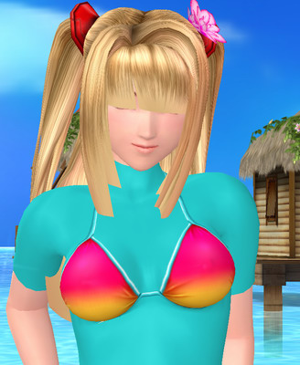

# Sexy Beach 3: Technical Help

Installation Guide
==================

Since Sexy Beach 3 is a Japanese game that won't install or run correctly on non-Japanese versions of Windows, you will need to alter some settings. There are several ways to do so:

-   Install and use either [Microsoft AppLocale](https://web.archive.org/web/20221209001033/http://www.microsoft.com/en-us/download/details.aspx?id=13209) (included with DeathMarine releases) or [HF pApploc](https://web.archive.org/web/20221209001033/http://www.hongfire.com/forum/showthread.php/328830) to run `StartSetup.exe` or `Setup.exe` to install the game.
    -   If you're using AppLocale, refer to DeathMarine's thread on [How to use AppLocale](https://web.archive.org/web/20221209001033/http://www.hshare.net/index.php?showtopic=1364)
    -   If you're using HF pApploc, simply use right-click and *Run with Japanese locale as administrator*
-   Alternatively, you may also simply change your "Regional and Language Settings" under Control Panel to Japanese if you don't want to install AppLocale.
    -   Under the "Language tab" in "Regional and Language Settings", check "Install files for East Asian languages" (requires Windows CD).
    -   Go to the "Advanced tab" change the language for "non-Unicode programs" to "Japanese".
    -   Usually, this is enough, but if your game still doesn't work, you will need to change the "Standards and Formats" under "Regional Settings" to Japanese as well.
    -   Restart the computer.
    -   [How-to Guide](https://web.archive.org/web/20221209001033/http://www.hshare.net/index.php?showtopic=681) with pictures by DeathMarine.
-   One final option that doesn't always work is to simply install from the .msi files instead of the .exes. This option usually bypasses the various checks that the .exe files uses, some which may be important such as checking whether or not you have the original Sexy Beach 3 or Sexy Beach 3 Gravure installed.

The game should be installed into **English folders** such as "Sexy Beach 3" (instead of the default "Sexyビーチ3") so that you won't run into a bunch of possible headaches in the future. Install Sexy Beach 3 first, followed by Sexy Beach 3 Plus, then Sexy Beach 3 Gravure, and finally the two small addons Flash and Santa Suit.

### HF Patch

When you have successfully installed the game you'll probably want to install the English translations and UI and a fixed launcher. The easiest way to install them all is through the [HF Patch](https://web.archive.org/web/20221209001033/http://www.hongfire.com/forum/showthread.php/64839-(Illusion)-Sexy-Beach-3/page3?p=1161252#post1161252).

### Need More Help?

If you still have problems after using this guide check out TheShadow's very [in-depth guide](https://web.archive.org/web/20221209001033/http://www.sinisterskintattoos.netfirms.com/sb31/files/FAQ/) on how to install Sexy Beach 3 and its addons. It goes over the same topics and much more.

Misc. Problems and FAQ
======================

-   **Q: When I run the game it reports: "Game detect non-japanese OS or more then one file are missing!". Any fix?**
    -   Go to start->run->and type 'regedit' in the box, navigate to HKEY_LOCAL_MACHINE\Software\Illusion and correct the INSTALLDIR value to your SB3 location (e.g. "c:\illusion\sb3\").
    -   If the game continues bringing the "Game detect non-japanese os or more then one file are missing!", another solution is to erase the characters in Japanese of the folder of the SB3.
    -   "Game detect non-japanese os or more then one file are missing!" Persiste otra solucion es borrar los caracteres en japones de la carpeta del SB3
-   **Q: When playing SB3 plus, flash or gravure the error message "Sexy Beach 3 (or plus) not found" or similar appear.**
    -   It is a problem due to a bad registry entry: the directory of the original SB3, or that of Plus, is not placed where the windows registry says it should. You must locate the registry entry with regedit, looking under "HKEY_LOCAL_MACHINE/SOFTWARE/Illusion/" and at that point you can either change the registry value so that it match the SB3 installation directory, OR move the SB3 directory to where the registry says it should be.
    -   **IMPORTANT NOTE FOR X64 OS USERS**: the same error appears to 64bit OS users, be it XP or vista or seven, even when they placed the Sb3 folder in the right place. The solution is to edit the illusion.reg file (just rename it to illusion.txt so you can open and work on it with notepad) by inserting the word "Wow6432Node" between the "software" and "illusion" part pf the various entry. Basically, the end result inside the .reg file will be like this: "HKEY_LOCAL_MACHINE\SOFTWARE\Wow6432Node\illusion". If you already used the .reg files before editing it, just use regedit to find and delete the old HKEY_LOCAL_MACHINE\SOFTWARE\illusion entry (if you dont you should receive the "non japanese os or some files missing" error message.
-   **Q: I downloaded the game but what do I do with .rar and .7z files?**
    -   Rar and 7z files are compressed files made to shrink the size of very large files for easy online distribution. You need to uncompress these files before you can use them. [7zip](https://web.archive.org/web/20221209001033/http://www.7zip.org/) (free download) can be used.
-   **Q: I installed the game and all the girls seem to be in black skins! How do I fix this?**
    -   This problem can be caused by a lot of different issues ranging from graphics to regional settings. The safest bet is to simply update your graphic drivers, update to the newest release of DirectX, and be sure to be using [TheShadow's modded .exe files](https://web.archive.org/web/20221209001033/http://www.hongfire.com/forum/showpost.php?p=1086195&postcount=1418) as for some circumstances, those problems are fixed.
    -   If you have done all of the above and still have this problem, then regional settings are most likely what's giving you all the trouble.
        -   "Go to Regional and Language Options" in the Control Panel, Regional Options tab, under Standards and Formats and be sure that the decimal point under numbers and currency is actually a "." (period) instead of a "," (comma) under your settings.
-   **Q: I installed SB3+ and now my game crashes every time I enter the living room!**
    -   Illusion has added animated movies onto the TV inside the living room, which is causing a lot of people to crash. These movies aren't really anything special and can simply be disabled from the Launcher menu from the game. Turning the movies off should stop the living room crashes. The movies can also be found in sb3x_0111.pp and sb3x_0112.pp
        -   If you download the anti movie crash files from School Mate, and rename to the 2 file names above and replace, this will fix the crashing error.
        -   Also crashes upon running can be avoided via the deletion of the mpg's in the data folder
    -   If you have done all of the above and still have this problem, then regional settings are most likely what's giving you all the trouble.
        -   "Go to Regional and Language Options" in the Control Panel, Regional Options tab, under Standards and Formats and select "Japanese".
-   **Q: I installed the English Installer of Sexy Beach 3 and it doesn't work! I'm also having problems with installing the SB3+ expansion!**
    -   This guide was made to support those who installed from the Japanese discs/ISOs. If you used the Full English Installer, you can find some help from the [Aervans' original thread](https://web.archive.org/web/20221209001033/http://www.hongfire.com/forum/showthread.php?p=1065999#post1065999). Unless you are comfortable editing the registry to fix any potential problems as mentioned in Aervans' thread, you should use the Japanese discs/ISOs.
-   **Q: When saving, I get multiple error messages and the game is not saved. What do I do now?**
    -   To solve this problem, create a 'save' folder into the 'data' folder.

Compatibility Issue with AMD/ATI HD 2000 series Video Hardware
--------------------------------------------------------------

Users with ATI HD 2400/2600/2900 will have some major graphic glitch that all the girl character's swimsuit cannot be shown properly. However the latest Catalyst 7.11 driver seems to fix the problem but still sometimes might have some mesh/object missing. For example, the hands and sun oil liquids, restarting the game seems to fix this temporary.

Related Link to this issue: [[1]](https://web.archive.org/web/20221209001033/http://www.hongfire.com/forum/showpost.php?p=1327800&postcount=1794)

Example Image of the issue above:

Tweak Fix: Turning off the Fog Effect in the option setting before starting the game may fix the missing objects (Hands and liquids). Tested with catalyst 8.4 Hotfix Driver.