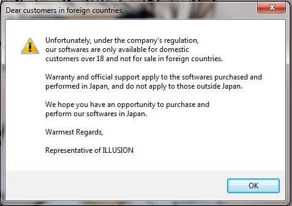

# Sexy Beach ZERO: Technical Help

*If you have problems installing or running the game, this is what you should read.* 

Installing the game
===================

Read [How to install](https://web.archive.org/web/20251016112757/https://wiki.anime-sharing.com/hgames/index.php?title=Illusion_Games_How_to_install "Illusion Games How to install") to learn how to install a Japanese game on your non-Japanese Windows.

Installation
------------

This section covers how to install the game on non-Japanese versions of Windows.

### Checklist

Check the following items to ensure a smooth installation:

-   Do you have the latest Daemon Tools Lite installed?

It is strongly recommended to use the latest version of Daemon Tools Lite. Other CD/DVD emulators may not be able to handle the Japanese characters in the Japanese disc image, even if you rename the image files. This causes errors like "[file] is not a Win32 Application" or corrupt data file errors.

Note: UltraISO virtual drive works fine and might be an option for people having problem with [SPTD Driver](https://web.archive.org/web/20251016112757/http://forum.imgburn.com/index.php?showtopic=11238) (the same Daemon Tools Lite and Alcohol use).

Virtual CloneDrive is not recommended since it will give problems with copying the sb03_00.pp file.

-   Do you have 7-Zip installed?

It's free, it's fast, and handles almost every compression format out of the box.

-   Is AppLocale installed?

A required tool to run Japanese games on non-Japanese Windows. See [How to Install](https://web.archive.org/web/20251016112757/https://wiki.anime-sharing.com/hgames/index.php?title=Illusion_Games_How_to_install "Illusion Games How to install") for details.

-   Do the DVD image path or filenames contain Japanese characters?

The disc image filenames should be in English, and they should be moved into a directory with no Japanese characters in the path.

### The installation process

1.  If you have compressed images (.rar, .zip), decompress the DVD images using 7-Zip. Remember to decompress them into a path that does not contain any Japanese characters!
2.  Mount disk 1.
    -   If an Autorun window pops up, close the window using the 'X' in the upper-right corner.
3.  Run AppLocale and use the process in [How to install](https://web.archive.org/web/20251016112757/https://wiki.anime-sharing.com/hgames/index.php?title=Illusion_Games_How_to_install "Illusion Games How to install") to install the game. There are two important things to remember:
    -   Do not install to C:\Program Files or C:\Program Files (x86) because the game will not be able to write your save data into those directories.
    -   Do not install to the default directory either, because you must install to an English path. This means you must change the install path to something else, like C:\Illusion\SBZERO.
4.  During the file copy process, an alert dialog will appear with Japanese text. This is the prompt for Disk 2. At this point, unmount the Disk 1 image and mount Disk 2, then click OK.
    -   Again, ignore any Autorun windows that appear.
5.  When the installation completes, test it by re-mounting Disk 1 and running the game through AppLocale.

FAQ
---

-   **Q: WinRAR can't extract "???.rar". Help?**\
    A: Rename it to e.g. "c:\downloads\game.rar" and it will work.
-   **Q: I can't mount the "DISK1.mds" or "DISK2.mds" in Daemon Tools, Alcohol 120%, Nero etc.? What can I do?**\
    A: Put it in an English folder, e.g. "C:\Downloads" and you can mount it.
-   **Q: When I try and run the installer I get an error about the installer not being a valid application.**\
    A: Install Daemon Tools Lite, mount the .mdf and run the setup from the virtual drive and it will work.
-   **Q: When I try to install the game it says my OS is incompatible, I'm on Windows 7 x64 Ultimate?**\
    A: The game has been confirmed to work on all versions of Windows (XP, Vista, 7) in both 32 and 64 bit. Install Daemon Tools Lite, mount the .mdf and run the setup from the virtual drive and it will work.
-   **Q: When I run the setup I get an error with unreadable text preceded by '1155:' (see screenshot). Anyone know how to fix this?**\
    A: This is a Japanese game and you have to run the setup with Japanese regional settings to install it. Learn how to [install the game](https://web.archive.org/web/20251016112757/https://wiki.anime-sharing.com/hgames/index.php?title=Sexy_Beach_ZERO/Technical_Help#Installing_the_game). For Windows 7, make sure applocale is run as administrator by right clicking on the shortcut, going to properties, clicking compatibility, and then checking "run this program as an administrator" to install the game.
-   **Q: When i try to run Startup.exe it gives me error saying it isn't a valid Win32 application.**
-   A: Use softwares like daemon tool and alcohol 120%. The error is caused by the unfamiliar characters other mounting tools cannot read.
-   **Q: Will the game run on Windows 10?**\
    A: Not without issues unless you switch system locale to Japanese, which you really shouldn't because you will experience [issues with other stuff](https://web.archive.org/web/20251016112757/https://wiki.anime-sharing.com/hgames/index.php?title=Illusion_Games_How_to_install#Why_not_change_regional_settings.3F "Illusion Games How to install"). You can't use AppLocale, but you can use NTLEA and Locale Emulator.

Addons
------

-   **Q: When installing the Plus 01 addon I get an error message in Japanese that is followed by the path name of the .exe?**\
    A: Run FileCopy.exe with AppLocale. Or, copy all the files from <extract location>\copy\setup to <your SBZ install folder>.

Running the game
================

-   **Q: I get an error when running the game: "Error Incorrupt", "Unable to find Configration file, wrong registry". What can I do?**\
    A: You have this problem because you installed the game to the default or an invalid location or because you just copied the files from the dvd's. Read how to install the game properly under [Installing the game](https://web.archive.org/web/20251016112757/https://wiki.anime-sharing.com/hgames/index.php?title=Sexy_Beach_ZERO/Technical_Help#Installing_the_game) below. Alternatively you can use the TheShadow's Registry Fixer to fix the install location and registry.

-   **Q: When I run the game I only see a black/white screen/video/nothing and then the game exits. What can I do?**\
    A: If you installed the game correctly: Update your graphics driver. If you didn't install the game correctly, [install the game correctly](https://web.archive.org/web/20251016112757/https://wiki.anime-sharing.com/hgames/index.php?title=Sexy_Beach_ZERO/Technical_Help#Installing_the_game). Also you can try run under windowed mode. If upgrading your graphics driver doesn't work, you have too old hardware to run this game.

-   **Q: When I run the game I get an error about missing filesit says d3dx9_43.dll is missing from my computer and doesn't run. I'm assuming it has something to do with DirectX9, but I have DirectX10 that came with my computer and Windows 7. What should I do to fix it?**\
    A: The Subtitle Overlay Mod requires the latest DirectX 9.0c. Download and install it from [here](https://web.archive.org/web/20251016112757/http://www.microsoft.com/downloads/en/details.aspx?FamilyID=2da43d38-db71-4c1b-bc6a-9b6652cd92a3&displaylang=en) and your game will work.

-   **Q: When I run the game I get a warning about the game not being for foreign customers (see screenshot). Anyone know how to fix this?**\
    A: This is a Japanese game and you have to run the game with Japanese regional settings (use AppLocale).

    

    Foreign warning

-   **Q: Is anyone else having a problem saving their game or changing their settings?**\
    A: This is probably because you installed the game to the default folder or the Program Files folder. Run the launcher as administrator or reinstall the game properly as described in [#Installing the game](https://web.archive.org/web/20251016112757/https://wiki.anime-sharing.com/hgames/index.php?title=Sexy_Beach_ZERO/Technical_Help#Installing_the_game) below.

Performance
-----------

-   **Q: How can I improve performance?**\
    A: With nvidia cards the best quality vs. performance settings are: Smooth Textures ON, Bilinear Interpolation ON, H/W Vortex ON, MipMap Settings OFF, Drawing Method #1 (Biggest performance hit ~30-40% decrease in fps), Glass Effect ON, Color Blending Effect ON, Water: UV, Texture: None. Then in nvidia control panel: Override program AA settings, 8xQ AA, Processing Mode: High Quality, 3 pixels.

-   **Q: The game is suffering the low framerate issue while running on Windows 10 build 1607 (also known as the Anniversary Update) and later.**\
    A: Since the Anniversary Update, Microsoft had modified the `d3d9.dll` file and is causing the problem for all non-unity illusion games. Illusion was aware of this problem and updated the support page to includes the `d3d9.exe` that has `d3d9.dll` in it for fixing this problem (Though you have to extract and copy paste the `d3d9.dll` into the game folder where the game's executable is). You can get it from here: [Support page for running game on Windows 10](https://web.archive.org/web/20251016112757/http://www.illusion.jp/support/windows10.html)

Modding the game
================

-   **Q: I get a .NET error when I use Illusion Wizzard 0.4.7.1, but I already updated [the profile](https://web.archive.org/web/20251016112757/http://www.hongfire.com/forum/showthread.php?t=243186&p=2602447#post2602447). What's up with that?**\
    A: You need to update PPExtractor to use the Wizzard with Sexy Beach ZERO. Get it [here](https://web.archive.org/web/20251016112757/http://www.hongfire.com/forum/showthread.php?t=243630) and put it in <wizzard location>\_general\tools.